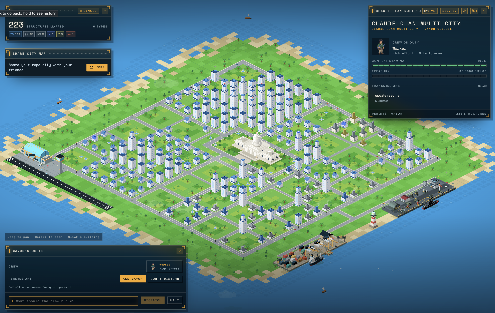
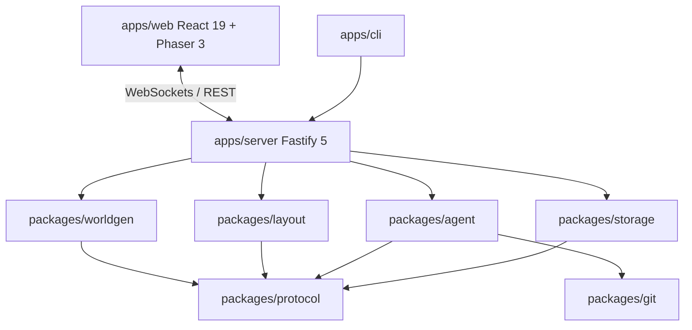

<div align="center">

# 🏙️ VisoAgent (Claude City)

### *Transform Software Repositories into Living, Spatial AI Coding Agent Cities*

[](#-acknowledgements)
[](https://nodejs.org/)
[](https://pnpm.io/)
[](https://www.typescriptlang.org/)
[](https://react.dev/)
[](https://phaser.io/)
[](https://fastify.dev/)
[](https://vitest.dev/)
[](#license)

<p align="center">
  <a href="#-key-features">Key Features</a> •
  <a href="#-gallery--screenshots">Gallery</a> •
  <a href="#-architecture--monorepo-topology">Architecture</a> •
  <a href="#-getting-started">Getting Started</a> •
  <a href="#-environment-configuration">Configuration</a> •
  <a href="#-scripts-reference">Scripts</a> •
  <a href="#-testing--quality">Testing</a>
</p>

---

</div>

## 📌 Overview

**VisoAgent (Claude City)** revolutionizes how developers visualize, interact with, and evolve software codebases. By parsing your repository structure, code metrics, and Git history, VisoAgent generates an interactive, spatial **2.5D isometric pixel-art city**. 

As the **Mayor** of your codebase, you can oversee high-level architectural health and deploy autonomous AI coding construction crews to build features, repair bugs, refactor modules, and run verification suites in parallel inside isolated Git worktrees.

> [!NOTE]
> VisoAgent maps repository directories to city blocks, code files to buildings scaled by lines of code (LOC), and AI agent workflows to active construction crews walking the city grid.

---

## ✨ Key Features

- 🏗️ **Spatial Codebase Visualization**: Render directories as city districts and files as 2.5D buildings with dynamic height based on LOC, churn, and complexity metrics.
- 👷 **Autonomous Agent Construction Crews**: Dispatch AI coding agents powered by Claude to tackle tasks asynchronously across your codebase.
- 🗺️ **Deterministic Treemap Layout Engine**: Uses a Squarified Block Treemap layout algorithm to ensure consistent spatial maps across repository scans.
- 🌿 **Git Worktree Isolation**: Agent operations take place in dedicated, non-destructive Git worktree environments without interrupting your active working branch.
- 📡 **Real-time Event Streaming**: Fastify WebSocket protocol delivers live agent activity streams, construction telemetry, and code diff progress directly to the canvas UI.
- 💵 **Budget & Safety Ceilings**: Enforce maximum spend ceilings per prompt (`SUDO_CITY_MAX_BUDGET_USD`) and strict command permissions.
- 🧪 **Built-in Inspector & Telemetry**: Click on any building to inspect file AST metrics, git history, current agent tasks, and open pull requests.

---

## 🖼️ Gallery & Screenshots

<div align="center">

### 🏙️ 2.5D Isometric Spatial City View
*Explore your codebase topology visually with real-time isometric rendering powered by Phaser 3 & React 19.*



<br/>

### 👷 Agent Crew Dispatcher & Picker
*Select, configure, and assign autonomous AI agent crews to execute refactoring, bug fixes, or feature tasks.*


<br/>

### 🔍 Building & File Inspector
*Inspect line counts, file health, test coverage, and live agent output by interacting directly with city blocks.*


</div>

---

## 🏛 Architecture & Monorepo Topology

VisoAgent is architected as a high-performance **pnpm monorepo** with clean layer boundaries:

```
claude-city/
├── 📁 apps/
│   ├── 🌐 web/                    # React 19 + Phaser 3 + Vite + Tailwind CSS v4 Frontend Client
│   ├── ⚡ server/                 # Fastify 5 + WebSockets + SQLite / Postgres Backend
│   └── 💻 cli/                    # `sudo-city` Command-Line Interface tool
├── 📁 packages/
│   ├── 📜 protocol/               # Shared Zod schemas, TypeScript types, and event contracts
│   ├── 🗺️ worldgen/               # Repository scanner, metric analyzer & AST parser
│   ├── 📐 layout/                 # Squarified Block Treemap deterministic spatial layout engine
│   ├── 💾 storage/                # SQLite (.visocity/world.db) & Postgres storage layer
│   ├── 🌿 git/                    # Git worktree manager & GitHub API integration
│   └── 🤖 agent/                  # Claude Agent SDK wrapper & task orchestration runtime
├── 📁 test/                       # Multi-module integration tests, mocks & test harnesses
└── 📁 docs/                       # Screenshots and architectural documentation
```

### Subsystem Dependency Flow



### Package Summary

| Package | Purpose | Primary Tech |
| :--- | :--- | :--- |
| [`apps/web`](apps/web) | Frontend canvas UI, isometric renderer & UI panels | React 19, Phaser 3, Vite, Tailwind CSS v4, Radix UI |
| [`apps/server`](apps/server) | Fastify HTTP API & WebSocket server for city state & agent stream | Fastify 5, WebSockets (`ws`), PostgreSQL / SQLite |
| [`apps/cli`](apps/cli) | Command-line starter and manager CLI | Node.js / `tsx` |
| [`packages/protocol`](packages/protocol) | Shared type definitions and Zod validation schemas | TypeScript, Zod |
| [`packages/worldgen`](packages/worldgen) | Code scanner, line counting, complexity & directory tree building | TypeScript |
| [`packages/layout`](packages/layout) | Squarified Treemap layout algorithm for building position calculations | TypeScript |
| [`packages/storage`](packages/storage) | World state, building metrics & agent activity log storage | SQLite, PostgreSQL |
| [`packages/git`](packages/git) | Git worktree lifecycle management & GitHub API bindings | Simple Git, GitHub API |
| [`packages/agent`](packages/agent) | Autonomous AI agent runtime and prompt handler | Anthropic Claude SDK |

---

## 🚀 Getting Started

### Prerequisites

Ensure your environment meets the following requirements:

- **Node.js**: `>= 22.0.0` (Recommended: Node 22.x LTS or Node 24.x)
- **pnpm**: `>= 10.0.0` (`corepack enable` or `npm install -g pnpm`)
- **Git**: `>= 2.38.0` (required for Git worktree support)

---

### 📥 1. Installation

Clone the repository and install all workspace dependencies:

```bash
git clone https://github.com/adithyanotfound/visoagent.git
cd claude-city
pnpm install
```

---

### ⚙️ 2. Environment Setup

Create your local `.env` configuration file by copying the template:

```bash
cp .env.example .env
```

Set any required environment variables:

```env
# Server Network Binding
HOST=127.0.0.1
PORT=4100
WEB_ORIGIN=http://127.0.0.1:5173

# Repository Target & Spend Limits
SUDO_CITY_REPO=.
SUDO_CITY_MAX_BUDGET_USD=1.00

# Anthropic API Key (Required for active AI Agent execution)
ANTHROPIC_API_KEY=your_anthropic_api_key_here
```

---

### 💻 3. Running the Application

#### Start Full Stack (Backend Server + Web Client concurrently)

```bash
pnpm dev
```

This will launch:
- ⚡ **Backend Server**: `http://127.0.0.1:4100` (Health check: `http://127.0.0.1:4100/health`)
- 🌐 **Web Frontend**: `http://127.0.0.1:5173`

#### Start Components Individually

- **Backend Server Only**:
  ```bash
  pnpm dev:server
  ```
- **Web Client Only**:
  ```bash
  pnpm dev:web
  ```

---

## ⚙️ Environment Configuration

| Variable | Default Value | Description |
| :--- | :--- | :--- |
| `HOST` | `127.0.0.1` | Network interface binding for Fastify server |
| `PORT` | `4100` | Port for Fastify HTTP and WebSocket server |
| `WEB_ORIGIN` | `http://127.0.0.1:5173` | Allowed CORS origin for frontend web client |
| `SUDO_CITY_REPO` | `.` | Target local repository path to visualize as a city |
| `SUDO_CITY_MAX_BUDGET_USD` | `1.00` | Spend ceiling in USD per agent run |
| `SUDO_CITY_CLONE_ROOT` | `.visocity/clones` | Directory where agent Git worktrees are managed |
| `ANTHROPIC_API_KEY` | *(Optional)* | API key for Anthropic Claude SDK agent runtime |
| `DATABASE_URL` | *(Optional)* | PostgreSQL connection URL (falls back to local SQLite `.visocity/world.db`) |
| `VITE_API_URL` | `http://127.0.0.1:4100` | API endpoint URL used by the Vite web application |
| `VITE_WS_URL` | `ws://127.0.0.1:4100/ws` | WebSocket endpoint URL used by the Vite web application |

---

## 🛠️ Scripts Reference

All primary commands are managed at the root level via `pnpm`:

| Command | Description |
| :--- | :--- |
| `pnpm dev` | Starts server and web development servers concurrently in parallel |
| `pnpm dev:server` | Starts Fastify backend with live reload (`tsx watch`) |
| `pnpm dev:web` | Starts Vite React frontend development server |
| `pnpm build` | Compiles TypeScript packages and builds production bundles |
| `pnpm test` | Runs complete Vitest test suite across all workspace projects |
| `pnpm test:unit` | Executes unit tests across packages and applications |
| `pnpm test:integration` | Runs subsystem, WebSocket, and HTTP integration tests |
| `pnpm test:coverage` | Generates v8 code coverage reports |
| `pnpm test:watch` | Starts Vitest in interactive watch mode |
| `pnpm typecheck` | Validates TypeScript types across all workspace projects |
| `pnpm lint` | Runs ESLint 9 across the monorepo |
| `pnpm lint:fix` | Automatically fixes ESLint rule violations |
| `pnpm format` | Formats codebase using Prettier |
| `pnpm format:check` | Verifies code formatting without mutating files |
| `pnpm validate` | Runs full local quality gate (`format:check` + `lint` + `typecheck` + `test` + `build`) |
| `pnpm ci` | Pipeline command executed in GitHub Actions CI |
| `pnpm clean` | Removes build artifacts (`dist`, `tsconfig.tsbuildinfo`) across workspaces |

---

## 🧪 Testing & Quality Assurance

VisoAgent relies on [Vitest](https://vitest.dev/) for unit and integration testing.

```bash
# Run unit tests
pnpm test:unit

# Run subsystem & WebSocket integration tests
pnpm test:integration

# Run tests with code coverage output
pnpm test:coverage
```

> [!TIP]
> VisoAgent includes a comprehensive test harness in `test/helpers/` featuring `MockAgentEngine` for offline agent execution testing and `TestWebSocketClient` for protocol verification.

---

## 🔌 API & Protocol Endpoints

- **`GET /health`**: Health check probe returning server version, timestamp, and target repo.
- **`WS /ws`**: Primary WebSocket channel for Mayor commands (dispatch agent, inspect block, stream logs) and real-time city updates.

---

## 🤝 Contributing

Contributions are welcome! Please follow these steps:

1. **Fork** the repository and create a feature branch (`git checkout -b feature/amazing-feature`).
2. Make your changes and write corresponding unit/integration tests.
3. Ensure all local quality gates pass:
   ```bash
   pnpm validate
   ```
4. Commit your changes (`git commit -m 'feat: add amazing feature'`).
5. Push to your branch and open a Pull Request.

---

## 🙏 Acknowledgements

Special thanks to **AO Agent** for assistance in building and architecting this project!

---

## 📄 License

Distributed under the **MIT License**. See `LICENSE` for details.

---

<div align="center">
  <sub>Built with ❤️ using <b>AO Agent</b> and the VisoAgent team. Driven by React 19, Phaser 3, Fastify, and Claude AI.</sub>
</div>
