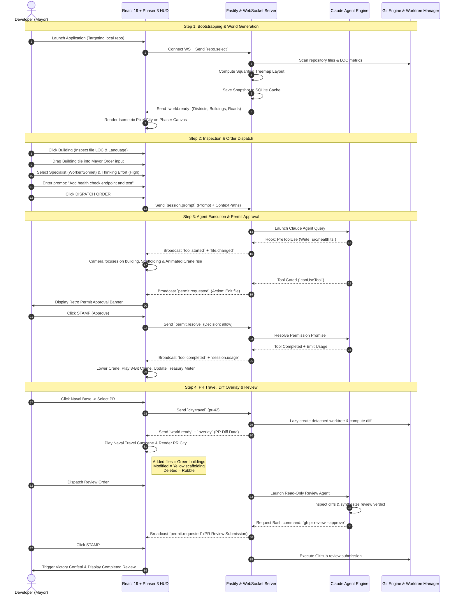
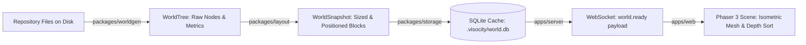
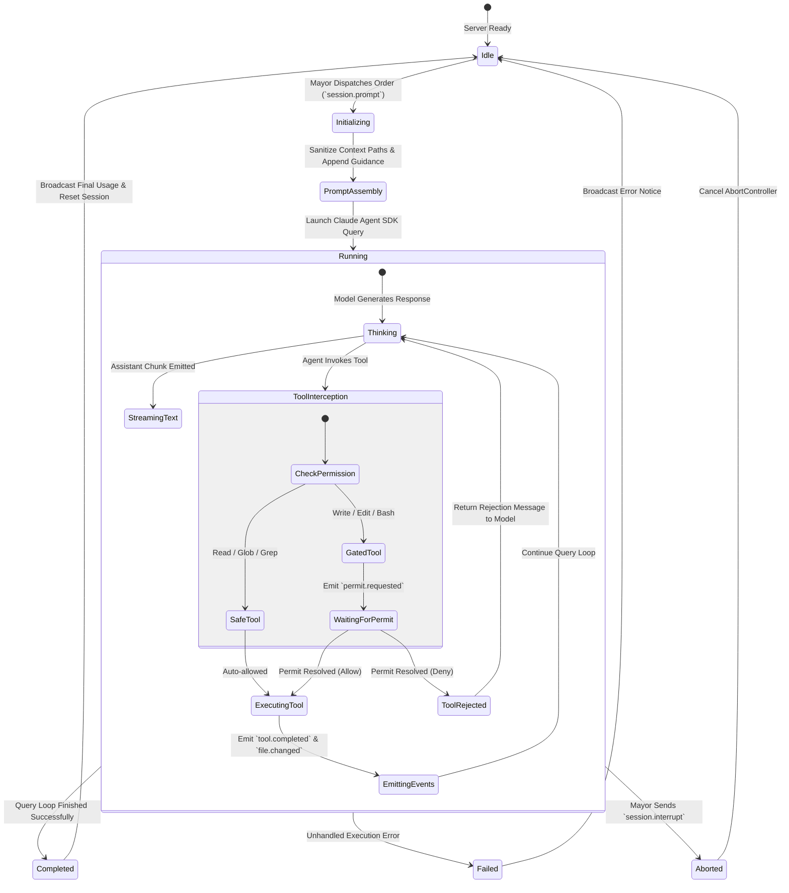
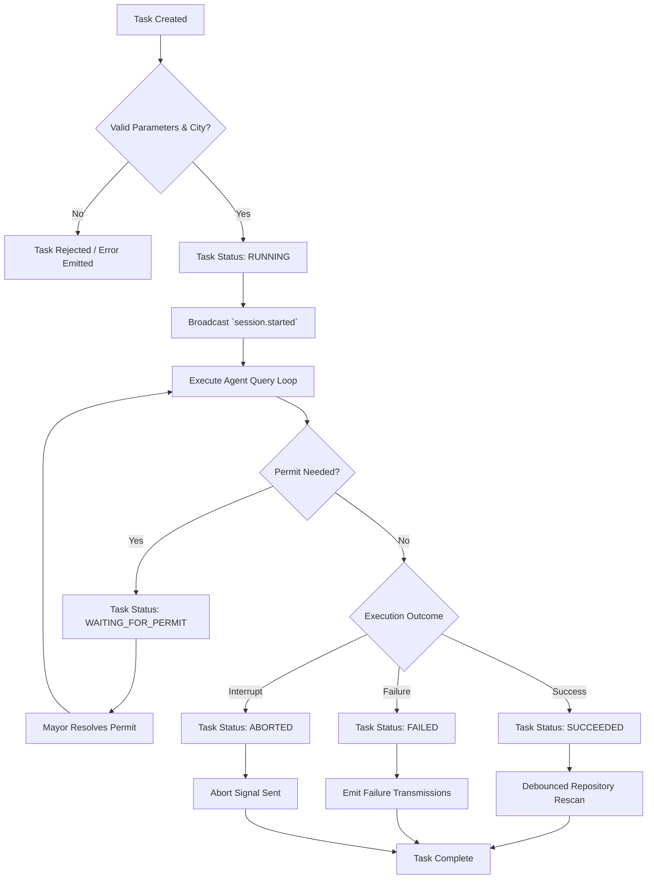
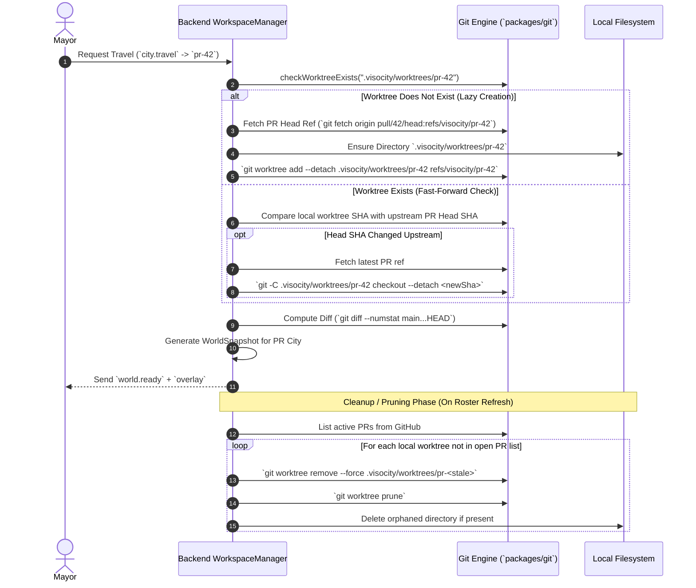
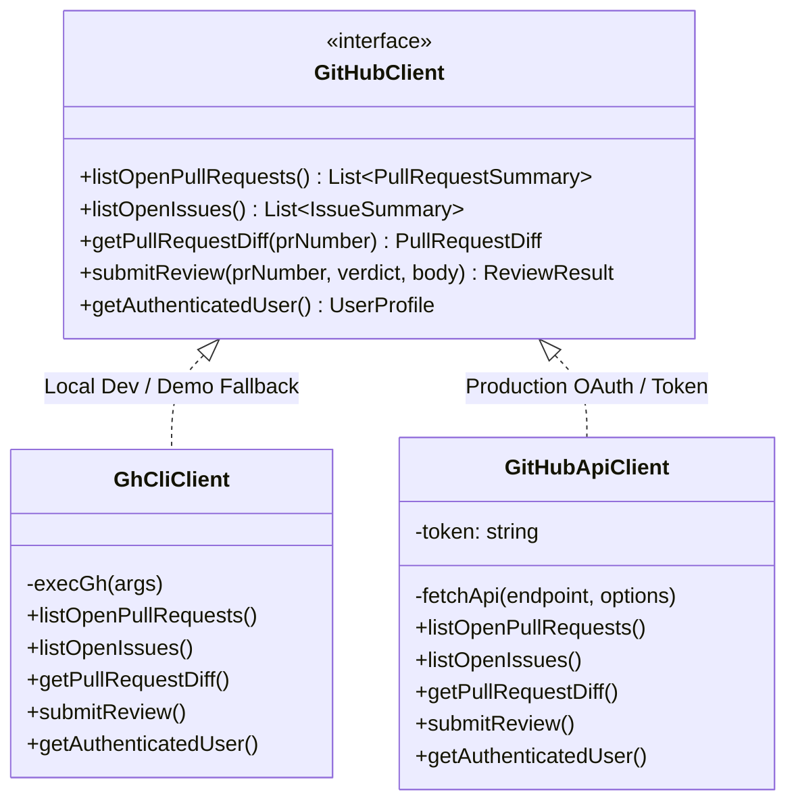
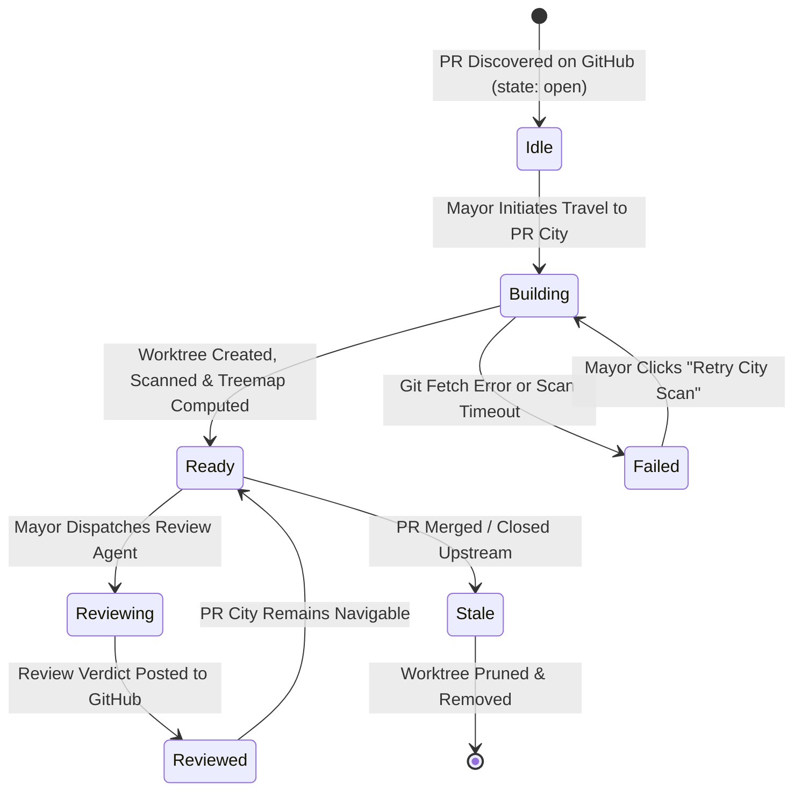

# System Architecture: Spatial AI Coding Agent City

This document defines the complete architecture for our independent implementation of the spatial codebase visualizer and autonomous AI coding agent orchestration platform. It is designed from scratch as a clean, modular, and hackathon-ready architecture that delivers the complete interactive developer experience without unnecessary enterprise overhead.

---

## Table of Contents

1. [Executive Summary & Core Metaphor](#1-executive-summary--core-metaphor)
2. [Hackathon Scope & Minimum Viable Demo Workflow](#2-hackathon-scope--minimum-viable-demo-workflow)
3. [System Architecture & Monorepo Topology](#3-system-architecture--monorepo-topology)
4. [Frontend / Backend Boundaries](#4-frontend--backend-boundaries)
5. [Agent Lifecycle](#5-agent-lifecycle)
6. [Task Lifecycle](#6-task-lifecycle)
7. [Worktree Lifecycle](#7-worktree-lifecycle)
8. [GitHub Integration](#8-github-integration)
9. [Pull Request Lifecycle](#9-pull-request-lifecycle)
10. [Review Lifecycle](#10-review-lifecycle)
11. [Data & State Model](#11-data--state-model)
12. [API Boundaries & Protocol Contracts](#12-api-boundaries--protocol-contracts)
13. [Testing Strategy](#13-testing-strategy)

---

## 1. Executive Summary & Core Metaphor

### 1.1. Core Concept

Our implementation transforms any Git software repository into an interactive, 2.5D isometric pixel-art city. The developer assumes the role of the **Mayor**, overseeing autonomous AI coding agents operating as visible **Construction Crews**.

```
┌────────────────────────────────────────────────────────────────────────┐
│                          THE METAPHOR MAPPING                          │
├───────────────────────────────┬────────────────────────────────────────┤
│ Software Engineering Domain   │ Spatial City Metaphor                  │
├───────────────────────────────┼────────────────────────────────────────┤
│ Repository Root / Main Branch │ Primary Capital City                   │
│ Directories                   │ Urban Districts (Sized by total LOC)   │
│ Source Code Files             │ Buildings (Height = LOC, Color = Lang) │
│ Import / Dependency Graph     │ Street & Highway Traffic Grid          │
│ Pull Requests (`pr-<num>`)    │ Detached Naval Port Cities             │
│ Issue Worktrees (`issue-<num>`)│ Detached Cargo Container Islands      │
│ External Repositories         │ Distant Cities accessed via Airport    │
│ Active Agent Tool Executions  │ Scaffolds, Animated Cranes & Crew      │
│ Human-in-the-Loop Approval    │ Mayor Permit Stamp / Deny Banner       │
│ Agent Execution Stream        │ Retro 8-bit Quest Radio Log            │
│ Diff Visualization            │ Scaffolding (Modified), New (Added),   │
│                               │ Rubble / Demolition (Deleted)          │
└───────────────────────────────┴────────────────────────────────────────┘
```

### 1.2. Design Principles for Hackathon Implementation

1. **Zero-Friction Local Bootstrapping**: Default to running against the local repository directory or any target path via `SUDO_CITY_REPO` without requiring PostgreSQL or complex external cloud infrastructure.
2. **Pure, Deterministic Pipeline**: World scanning and spatial treemap layouts are deterministic, pure functions ($O(N)$ time complexity) allowing instant recalculation and reliable caching in SQLite.
3. **Strict Protocol Contracts**: Frontend and backend communicate exclusively through typed Zod-validated WebSocket messages and JSON REST endpoints.
4. **Resilient Agent Sandboxing**: All agent file edits are executed in isolated Git worktrees, guarding the primary working tree from corruption.
5. **Interactive Delight**: Rich visual feedback (Phaser isometric canvas, procedural 8-bit audio, camera tweens, victory particle confetti).

---

## 2. Hackathon Scope & Minimum Viable Demo Workflow

### 2.1. Feature Matrix (Hackathon Demo vs. Post-Hackathon)

| Feature Component      | In-Scope for Hackathon Demo                                                                                                                           | Post-Hackathon Extension                                                                      |
| ---------------------- | ----------------------------------------------------------------------------------------------------------------------------------------------------- | --------------------------------------------------------------------------------------------- |
| **World Generation**   | Single-pass file scan, language detection, squarified treemap layout, basic dependency links for roads                                                | Full AST graph parsing for circular dependency detection across multiple languages            |
| **City Canvas**        | Phaser 3 isometric tile grid, dynamic camera pan/zoom/focus, building hover/click, animated construction cranes                                       | Ambient procedural day/night cycles, dynamic weather particles, vehicular traffic pathfinding |
| **Mayor HUD**          | Collapsible Console, Specialist selector (Architect, Worker, Runner), Order Dispatch with Drag & Drop file attachment, Building Inspector             | Multi-monitor detachable floating windows, customizable themes                                |
| **Agent Engine**       | Anthropic Claude Agent SDK integration, hook streaming (`PreToolUse`, `PostToolUse`, `FileChanged`), permission gating (`canUseTool`), spend tracking | Multi-agent parallel swarm consensus, external tool plugins (LSP, debugger)                   |
| **Worktree Engine**    | Lazy worktree checkout for PRs and Issues, detached HEAD isolation, automatic branch cleanup                                                          | Remote worktree virtualization via Docker/Firecracker containers                              |
| **GitHub Integration** | Personal Access Token fallback (`GITHUB_TOKEN`) and GitHub CLI (`gh`) integration; basic GitHub App OAuth                                             | Enterprise GitHub Server SSO, webhook receiver daemon                                         |
| **PR & Code Review**   | Visual diff overlays (new, modified, deleted buildings), read-only review agent execution, interactive Stamp/Deny approval, review submission         | Inline file comment threads, automated merge conflict resolver                                |
| **Persistence**        | Embedded SQLite (`.visocity/world.db`) with WAL mode for snapshots, layout cache, and event history                                                   | Multi-tenant PostgreSQL cluster with distributed session replication                          |

### 2.2. Minimum Viable Demo Workflow (The 3-Minute Golden Path)



---

## 3. System Architecture & Monorepo Topology

### 3.1. Monorepo Package Layout

We structure the repository as a clean `pnpm` monorepo with strict package boundary separation:

```
├── apps/
│   ├── web/                     # Frontend Application (React 19 + Phaser 3 + Vite)
│   │   ├── src/
│   │   │   ├── canvas/          # Phaser 3 Isometric Game Scenes & Managers
│   │   │   │   ├── WorldScene.ts
│   │   │   │   ├── WorldBuildingManager.ts
│   │   │   │   ├── WorldTerrainManager.ts
│   │   │   │   ├── WorldCameraController.ts
│   │   │   │   ├── WorldCraneManager.ts
│   │   │   │   └── WorldHarbourManager.ts
│   │   │   ├── components/      # React 19 HUD & Dialogs
│   │   │   │   ├── AppHudConsole.tsx
│   │   │   │   ├── AppHudOrder.tsx
│   │   │   │   ├── AppHudInspector.tsx
│   │   │   │   ├── AppHudTransmissions.tsx
│   │   │   │   ├── AppDialogs.tsx
│   │   │   │   └── PermitApprovalModal.tsx
│   │   │   ├── hooks/           # WebSocket, Game State & Audio hooks
│   │   │   │   ├── useGameState.ts
│   │   │   │   ├── useWebSocket.ts
│   │   │   │   └── useSoundEngine.ts
│   │   │   └── main.tsx
│   │   └── package.json
│   │
│   └── server/                  # Backend Application (Fastify 5 + WebSocket)
│       ├── src/
│       │   ├── routes/          # REST endpoints (/health, /auth, /api/repos)
│       │   ├── ws/              # WebSocket multiplexer & command router
│       │   ├── workspace/       # WorkspaceManager & City Session isolation
│       │   ├── server.ts        # Fastify bootstrap
│       │   └── config.ts        # Environment variable parsing
│       └── package.json
│
├── packages/
│   ├── protocol/                # Shared Zod schemas, TypeScript types, constants
│   │   ├── src/
│   │   │   ├── events.ts        # ServerMessage and GameEvent schemas
│   │   │   ├── commands.ts      # MayorCommand schemas
│   │   │   ├── world.ts         # District, Building, Road, Snapshot schemas
│   │   │   ├── diff.ts          # PullRequestOverlay & Diff schemas
│   │   │   └── index.ts
│   │   └── package.json
│   │
│   ├── worldgen/                # Repository file scanner & metric collector
│   │   ├── src/
│   │   │   ├── scanner.ts       # Fast filesystem crawler with .gitignore parser
│   │   │   ├── language.ts      # Extension-to-language mapper & color palette
│   │   │   ├── dependencies.ts  # Import scanner for road graph generation
│   │   │   └── index.ts
│   │   └── package.json
│   │
│   ├── layout/                  # Deterministic Squarified Block Treemap layout engine
│   │   ├── src/
│   │   │   ├── treemap.ts       # Pure squarified treemap recursive partitioner
│   │   │   ├── grid.ts          # Isometric coordinate mapper (u, v, w, h, z)
│   │   │   ├── landmarks.ts     # Core landmark placement (Capitol, Port, Navy)
│   │   │   └── index.ts
│   │   └── package.json
│   │
│   ├── agent/                   # Agent orchestration & Claude Agent SDK wrapper
│   │   ├── src/
│   │   │   ├── session.ts       # AgentSessionManager & execution loop
│   │   │   ├── permissions.ts   # Permit gatekeeper & promise resolver
│   │   │   ├── tools.ts         # Tool registration & safe/gated definitions
│   │   │   ├── prompts.ts       # Specialist system prompts (Architect, Worker, Runner, Reviewer)
│   │   │   └── index.ts
│   │   └── package.json
│   │
│   ├── git/                     # Git worktree & GitHub API/CLI client
│   │   ├── src/
│   │   │   ├── worktree.ts      # Detached worktree manager & pruning
│   │   │   ├── diff.ts          # Fast git diff parser (--numstat, --name-status)
│   │   │   ├── github.ts        # Dual GitHub client (API + GitHub CLI)
│   │   │   └── index.ts
│   │   └── package.json
│   │
│   └── storage/                 # Embedded SQLite persistence (WAL mode)
│       ├── src/
│       │   ├── db.ts            # SQLite connection using node:sqlite / better-sqlite3
│       │   ├── schema.ts        # Migrations & table definitions
│       │   ├── repository.ts    # Snapshot and GameEvent query repository
│       │   └── index.ts
│       └── package.json
│
├── docs/                        # Architecture & reference documentation
├── package.json                 # pnpm workspace root configuration
├── pnpm-workspace.yaml
└── tsconfig.base.json
```

### 3.2. End-to-End Pure Data Pipeline



---

## 4. Frontend / Backend Boundaries

### 4.1. Division of Responsibilities

```
┌───────────────────────────────────────────────────────────────────────────┐
│                           FRONTEND (apps/web)                             │
│                                                                           │
│  • Phaser 3 2.5D Isometric Canvas Rendering                               │
│  • Camera Pan, Zoom, Smooth Focus Tweens, and Inertia Clamping            │
│  • Dynamic Texture Atlas Generation & Building Sprites                    │
│  • Animated Construction Scaffolding, Cranes, and Sprite Movement         │
│  • React 19 Floating Retro HUD (Console, Order Form, Transmissions, Meter)│
│  • Drag-and-Drop Building Context Selection from Canvas to Order Form     │
│  • Client-side State Cache (localStorage event fallback)                  │
│  • Web Audio API Procedural 8-bit Sound Effects Engine                    │
│  • Naval & Aircraft Travel Cutscene Playback                              │
│  • Confetti Particle Celebration System                                   │
└─────────────────────────────────────▲─────────────────────────────────────┘
                                      │
            WebSocket Protocol (/ws): │ HTTP REST API (/api/*):
            - MayorCommand (Outbound) │ - GET /health
            - ServerMessage (Inbound) │ - GET/POST /auth/*
                                      │ - GET/POST /api/repos/*
                                      │
┌─────────────────────────────────────▼─────────────────────────────────────┐
│                           BACKEND (apps/server)                           │
│                                                                           │
│  • Fastify 5 HTTP & WebSocket Connection Lifecycle Management             │
│  • Repository Filesystem Scanning & LOC Analysis (packages/worldgen)      │
│  • Deterministic Squarified Treemap Layout Engine (packages/layout)       │
│  • SQLite Snapshot & Event History Persistence (packages/storage)         │
│  • Git Worktree Creation, Detached Checkout & Pruning (packages/git)      │
│  • PR Git Diff Computation & Overlay Synthesis                            │
│  • Claude Agent SDK Session Loop Orchestration (packages/agent)           │
│  • Tool Permission Interception & Permit Promise Gating                   │
│  • Context File Path Normalization & Sandboxing Security                  │
│  • Spend Metering & Treasury Ceiling Enforcement                          │
│  • GitHub API / GitHub CLI Bridge                                         │
└───────────────────────────────────────────────────────────────────────────┘
```

### 4.2. Boundary Invariants

1. **No Direct Filesystem Access from Frontend**: The client never makes assumptions about file paths; all file contents, diffs, and geometries are delivered as serialized protocol structures.
2. **Deterministic Layout Math on Backend**: To maintain identical coordinate systems across multiple clients and server sessions, geometry layout is strictly computed by `packages/layout` on the server.
3. **Optimistic HUD vs. Authoritative Server Events**: The frontend displays immediate local UI feedback (e.g. typing in prompt, opening dialogs), but agent status, crane positions, spend numbers, and construction sites are strictly driven by authoritative `ServerMessage` broadcasts.

---

## 5. Agent Lifecycle

### 5.1. Lifecycle State Machine



### 5.2. Crew Specialists & System Prompts

The Mayor selects from three specialized agent personas:

1. **The Architect (Claude Opus / High Effort)**:
   - _Target_: Large-scale architectural refactors, cross-cutting feature additions, multi-file redesigns.
   - _System Prompt Focus_: Comprehensive code analysis, dependency tree awareness, backward compatibility.
2. **The Worker (Claude Sonnet / Medium-High Effort)**:
   - _Target_: General-purpose feature construction, bug fixes, unit tests, and routine modifications.
   - _System Prompt Focus_: Direct, high-precision code edits, adhering strictly to existing code idioms.
3. **The Runner (Claude Haiku / Low Effort)**:
   - _Target_: Quick renames, single-line bug fixes, formatting corrections, documentation tweaks.
   - _System Prompt Focus_: Minimal latency, concise changes, zero extraneous tool calls.

### 5.3. Permission Gating & Permit Resolution

- When an agent invokes a gated tool (`Write`, `Edit`, `Bash`):
  1. The SDK query execution halts on an unresolved JavaScript Promise inside `canUseTool`.
  2. The server generates a unique `permitId` and broadcasts `permit.requested` containing tool name, target file path, and proposed parameters.
  3. The Mayor views the permit modal and submits `permit.resolve` (`allow` or `deny`).
  4. The server matches `permitId`, resolves the awaiting promise, and the agent loop resumes.

---

## 6. Task Lifecycle

### 6.1. Task Classification

Tasks represent unit goals executed within a city session:

- **Mayor Orders**: Interactive coding prompts dispatched from the HUD.
- **PR Code Reviews**: Automated static diff inspection and verdict publishing.
- **Background Scans**: Repository rescanning triggered after agent file edits.

### 6.2. Task State Transitions



---

## 7. Worktree Lifecycle

### 7.1. Worktree Directory Topology

All isolated worktrees are stored inside a hidden directory within the target repository (`.visocity/worktrees/`):

```
<repo-root>/
├── .visocity/
│   ├── world.db                  # Local SQLite database (WAL mode)
│   └── worktrees/
│       ├── pr-42/                # Detached worktree for PR #42
│       │   └── (PR #42 head checkout)
│       ├── pr-108/               # Detached worktree for PR #108
│       └── issue-15/             # Detached writable worktree for Issue #15
├── src/                          # Primary working tree (City: main)
└── package.json
```

### 7.2. Worktree Operations Flow



---

## 8. GitHub Integration

### 8.1. Dual GitHub Client Architecture

To maximize development velocity and support both offline demo setups and live cloud testing, `packages/git` implements a unified `GitHubClient` interface with two drivers:



### 8.2. Authentication Modes

1. **Demo / Local Fallback**: When `GITHUB_CLIENT_ID` is not configured, the backend uses `GhCliClient` (delegating to the local `gh` CLI session) or reads `process.env.GITHUB_TOKEN`.
2. **GitHub App OAuth Flow**:
   - `GET /auth/github/start`: Generates signed CSRF state and redirects to `https://github.com/login/oauth/authorize`.
   - `GET /auth/github/callback`: Exchanges authorization code for `access_token`, saves user session, and issues a 256-bit Bearer token.

---

## 9. Pull Request Lifecycle

### 9.1. PR Roster State Progression

Every detected PR in the upstream repository is tracked through explicit lifecycle states:



### 9.2. Diff Overlay Computation

When generating the spatial map for a PR city, the backend computes the diff against `main`:

1. **`git diff --name-status main...HEAD`**: Identifies added (`A`), modified (`M`), and deleted (`D`) file paths.
2. **`git diff --numstat main...HEAD`**: Extracts insertions and deletions per file.
3. **Visual Representation Mapping**:
   - **Added Files ($A$)**: Rendered as newly constructed buildings with a vibrant green base highlight.
   - **Modified Files ($M$)**: Rendered as standard buildings overlaid with yellow construction scaffold textures.
   - **Deleted Files ($D$)**: Rendered as flat rubble plots marking the historical position of the removed file.

---

## 10. Review Lifecycle

### 10.1. Constrained Review Agent Sandbox

When an agent is launched inside a PR city (`pr-<number>`):

1. **Tool Stripping**: Modifying tools (`Write`, `Edit`, `NotebookEdit`) are disabled in the agent configuration, enforcing strict read-only analysis.
2. **Review System Prompt**: The agent is provided with the base branch name, head commit SHA, list of changed files, and the PR description.
3. **Verdict Synthesis**: The agent produces structured review commentary and picks a verdict:
   - `APPROVE`: Clean changes, good test coverage, no obvious bugs.
   - `REQUEST_CHANGES`: Logical flaws, missing edge cases, security regressions.
   - `COMMENT`: General architectural observations or minor questions.
4. **Permit Gating Before Submission**: The execution of `gh pr review <number> --<verdict> --body "..."` triggers a `permit.requested` event, requiring the Mayor to stamp approval before publishing upstream.

---

## 11. Data & State Model

### 11.1. Protocol Schema Definitions (Zod)

#### 11.1.1. World & Geometry Models

```typescript
import { z } from 'zod';

export const BuildingSchema = z.object({
  id: z.string(),
  path: z.string(),
  filename: z.string(),
  districtId: z.string(),
  language: z.string(),
  colorHex: z.string(),
  loc: z.number().int().nonnegative(),
  // Isometric Grid Coordinates:
  gridX: z.number().int(),
  gridY: z.number().int(),
  width: z.number().int().positive(),
  height: z.number().int().positive(),
  elevation: z.number().int().nonnegative(),
});
export type Building = z.infer<typeof BuildingSchema>;

export const DistrictSchema = z.object({
  id: z.string(),
  path: z.string(),
  name: z.string(),
  loc: z.number().int().nonnegative(),
  gridX: z.number().int(),
  gridY: z.number().int(),
  width: z.number().int().positive(),
  height: z.number().int().positive(),
  colorHex: z.string(),
});
export type District = z.infer<typeof DistrictSchema>;

export const WorldSnapshotSchema = z.object({
  cityId: z.string(),
  repoName: z.string(),
  commitSha: z.string(),
  totalLoc: z.number().int().nonnegative(),
  bounds: z.object({
    minX: z.number().int(),
    minY: z.number().int(),
    maxX: z.number().int(),
    maxY: z.number().int(),
  }),
  districts: z.array(DistrictSchema),
  buildings: z.array(BuildingSchema),
  roads: z.array(
    z.object({
      from: z.object({ x: z.number(), y: z.number() }),
      to: z.object({ x: z.number(), y: z.number() }),
    }),
  ),
});
export type WorldSnapshot = z.infer<typeof WorldSnapshotSchema>;
```

#### 11.1.2. PR Overlay & Diff Schema

```typescript
export const FileDiffStatusSchema = z.enum(['added', 'modified', 'deleted', 'renamed']);

export const FileDiffEntrySchema = z.object({
  path: z.string(),
  status: FileDiffStatusSchema,
  insertions: z.number().int().nonnegative(),
  deletions: z.number().int().nonnegative(),
  oldPath: z.string().optional(),
});

export const PullRequestOverlaySchema = z.object({
  cityId: z.string(),
  prNumber: z.number().int().positive(),
  title: z.string(),
  author: z.string(),
  baseSha: z.string(),
  headSha: z.string(),
  changedFiles: z.array(FileDiffEntrySchema),
});
export type PullRequestOverlay = z.infer<typeof PullRequestOverlaySchema>;
```

#### 11.1.3. Mayor Commands (Client $\rightarrow$ Server)

```typescript
export const MayorCommandSchema = z.discriminatedUnion('type', [
  z.object({
    type: z.literal('session.auth'),
    token: z.string(),
  }),
  z.object({
    type: z.literal('repo.select'),
    repoPath: z.string(),
  }),
  z.object({
    type: z.literal('session.prompt'),
    cityId: z.string(),
    prompt: z.string(),
    model: z.enum(['opus', 'sonnet', 'haiku']),
    effort: z.enum(['low', 'medium', 'high', 'max']),
    permissionMode: z.enum(['default', 'auto']),
    contextPaths: z.array(z.string()),
  }),
  z.object({
    type: z.literal('session.interrupt'),
    cityId: z.string(),
  }),
  z.object({
    type: z.literal('permit.resolve'),
    permitId: z.string(),
    decision: z.enum(['allow', 'deny']),
    reason: z.string().optional(),
  }),
  z.object({
    type: z.literal('city.travel'),
    cityId: z.string(),
  }),
  z.object({
    type: z.literal('diff.request'),
    cityId: z.string(),
    filePath: z.string(),
  }),
]);
export type MayorCommand = z.infer<typeof MayorCommandSchema>;
```

#### 11.1.4. Server Messages (Server $\rightarrow$ Client)

```typescript
export const GameEventSchema = z.discriminatedUnion('type', [
  z.object({
    type: z.literal('session.started'),
    cityId: z.string(),
    sessionId: z.string(),
    timestamp: z.number(),
  }),
  z.object({
    type: z.literal('assistant.message'),
    cityId: z.string(),
    textChunk: z.string(),
  }),
  z.object({
    type: z.literal('tool.started'),
    cityId: z.string(),
    toolName: z.string(),
    targetPath: z.string().optional(),
    input: z.record(z.unknown()),
  }),
  z.object({
    type: z.literal('tool.completed'),
    cityId: z.string(),
    toolName: z.string(),
    targetPath: z.string().optional(),
    success: z.boolean(),
  }),
  z.object({
    type: z.literal('file.changed'),
    cityId: z.string(),
    filePath: z.string(),
    changeType: z.enum(['create', 'modify', 'delete']),
  }),
  z.object({
    type: z.literal('permit.requested'),
    cityId: z.string(),
    permitId: z.string(),
    toolName: z.string(),
    description: z.string(),
    targetPath: z.string().optional(),
  }),
  z.object({
    type: z.literal('session.usage'),
    cityId: z.string(),
    costUsd: z.number(),
    totalSpendUsd: z.number(),
    budgetLimitUsd: z.number(),
  }),
  z.object({
    type: z.literal('session.finished'),
    cityId: z.string(),
    status: z.enum(['completed', 'aborted', 'error']),
    summary: z.string().optional(),
  }),
]);
export type GameEvent = z.infer<typeof GameEventSchema>;

export const ServerMessageSchema = z.discriminatedUnion('type', [
  z.object({
    type: z.literal('world.ready'),
    snapshot: WorldSnapshotSchema,
  }),
  z.object({
    type: z.literal('overlay'),
    overlay: PullRequestOverlaySchema,
  }),
  z.object({
    type: z.literal('event'),
    event: GameEventSchema,
  }),
  z.object({
    type: z.literal('cities.roster'),
    cities: z.array(
      z.object({
        cityId: z.string(),
        label: z.string(),
        kind: z.enum(['main', 'pr', 'issue', 'local']),
        status: z.enum(['idle', 'building', 'ready', 'failed']),
        prNumber: z.number().optional(),
      }),
    ),
  }),
  z.object({
    type: z.literal('diff.response'),
    filePath: z.string(),
    unifiedDiff: z.string(),
  }),
  z.object({
    type: z.literal('error'),
    message: z.string(),
    code: z.string().optional(),
  }),
]);
export type ServerMessage = z.infer<typeof ServerMessageSchema>;
```

### 11.2. SQLite Database Schema (`.visocity/world.db`)

```sql
PRAGMA journal_mode = WAL;
PRAGMA synchronous = NORMAL;

CREATE TABLE IF NOT EXISTS snapshots (
    city_id TEXT PRIMARY KEY,
    repo_name TEXT NOT NULL,
    commit_sha TEXT NOT NULL,
    total_loc INTEGER NOT NULL,
    snapshot_json TEXT NOT NULL,
    updated_at INTEGER NOT NULL
);

CREATE TABLE IF NOT EXISTS events (
    id INTEGER PRIMARY KEY AUTOINCREMENT,
    city_id TEXT NOT NULL,
    session_id TEXT NOT NULL,
    event_type TEXT NOT NULL,
    event_payload TEXT NOT NULL,
    created_at INTEGER NOT NULL
);

CREATE TABLE IF NOT EXISTS permits (
    permit_id TEXT PRIMARY KEY,
    city_id TEXT NOT NULL,
    tool_name TEXT NOT NULL,
    target_path TEXT,
    status TEXT NOT NULL DEFAULT 'pending',
    created_at INTEGER NOT NULL,
    resolved_at INTEGER
);

CREATE INDEX IF NOT EXISTS idx_events_city_session ON events (city_id, session_id);
```

---

## 12. API Boundaries & Protocol Contracts

### 12.1. HTTP REST Endpoints

| Method | Endpoint                | Description                  | Request Body                              | Response (200 OK)                                                    |
| ------ | ----------------------- | ---------------------------- | ----------------------------------------- | -------------------------------------------------------------------- |
| `GET`  | `/health`               | Server health check probe    | None                                      | `{ "status": "ok", "version": "1.0.0" }`                             |
| `GET`  | `/auth/github/start`    | Initiates GitHub OAuth flow  | None                                      | Redirects to GitHub authorization URL                                |
| `GET`  | `/auth/github/callback` | OAuth redirect callback      | Query: `?code=...&state=...`              | Redirects to frontend with Bearer token                              |
| `GET`  | `/api/auth/session`     | Validate current user token  | Headers: `Authorization: Bearer <token>`  | `{ "user": { "id": "123", "login": "octocat" } }`                    |
| `GET`  | `/api/repos`            | List accessible repositories | Headers: `Authorization: Bearer <token>`  | `{ "repos": [{ "name": "visoagent", "owner": "adithyanotfound" }] }` |
| `POST` | `/api/repos/import`     | Import & clone repository    | `{ "repoUrl": "https://github.com/..." }` | `{ "repoKey": "adithyanotfound_visoagent", "status": "ready" }`      |

### 12.2. WebSocket Handshake & Streaming (`/ws`)

- **Connection URL**: `ws://127.0.0.1:4100/ws`
- **Framing**: UTF-8 JSON text frames conforming strictly to `MayorCommand` (client-to-server) and `ServerMessage` (server-to-client).
- **Heartbeat & Reconnection**:
  - The client sends ping frames every 15 seconds.
  - On disconnection, the frontend engages exponential backoff reconnection (`baseDelay: 1000ms`, `maxDelay: 30000ms`).
  - Upon reconnection, the client transmits `session.auth` followed by `city.travel` to resume the active session stream.

---

## 13. Testing Strategy

### 13.1. Test Suite Architecture

```
                    ┌─────────────────────────┐
                    │    End-to-End Tests     │
                    │  Playwright Demo Script │
                    └────────────┬────────────┘
                                 │
                    ┌────────────▼────────────┐
                    │    Integration Tests    │
                    │ Fastify WS + Mock Agent │
                    └────────────┬────────────┘
                                 │
        ┌────────────────────────┴────────────────────────┐
        │                                                 │
┌───────▼──────────────┐                        ┌─────────▼──────────────┐
│  Domain Unit Tests   │                        │  Protocol Unit Tests   │
│ - Squarified Treemap │                        │ - Zod Schema Validation│
│ - Coordinate Mapping │                        │ - Command Framing      │
│ - Git Diff Parsing   │                        │ - Path Sandboxing      │
└──────────────────────┘                        └────────────────────────┘
```

### 13.2. Test Suites Specification

#### 1. Unit Tests (`vitest`)

- **`packages/layout`**:
  - Validates that squarified treemap partition generates zero overlapping rectangles ($[x_1, x_2] \cap [y_1, y_2] = \emptyset$).
  - Validates that building heights monotonically correlate with LOC.
  - Validates that isometric projection conversion correctly maps $(u, v)$ to $(screenX, screenY)$.
- **`packages/protocol`**:
  - Validates that invalid `MayorCommand` inputs are immediately rejected with descriptive Zod errors.
  - Ensures all `GameEvent` types parse and serialize bidirectionally without loss.
- **`packages/git`**:
  - Validates parsing of raw `git diff --numstat` output into `FileDiffEntry` structures.
  - Tests path traversal sanitization (e.g. `../../../etc/passwd` $\rightarrow$ rejected).

#### 2. Mock Agent SDK Integration Tests

- A dedicated mock agent harness (`MockAgentEngine`) replaces the Anthropic network calls during automated testing:
  - Simulates streaming token delivery chunk by chunk.
  - Simulates gated tool calls to assert that `permit.requested` correctly halts execution until `permit.resolve` arrives.
  - Verifies that denying a permit passes `{ behavior: 'deny' }` back to the model context.

#### 3. WebSocket Integration Tests

- Boots a transient Fastify server on an ephemeral port.
- Connects a real WebSocket client to verify the complete handshake: `repo.select` $\rightarrow$ `world.ready` $\rightarrow$ `session.prompt` $\rightarrow$ `tool.started` $\rightarrow$ `session.finished`.

#### 4. Hackathon Demo Verification Checklist (Manual QA)

- [ ] **Bootstrap**: Run `pnpm dev` from clean state; loads demo repository within 2 seconds.
- [ ] **Canvas**: Smooth pan (drag) and zoom (wheel); clicking building opens Inspector with file stats.
- [ ] **Drag & Drop**: Dragging building tile populates context input in Mayor Order form.
- [ ] **Agent Execution**: Dispatch order; animated crane appears above target building; radio transmissions log streams events.
- [ ] **Permit Gate**: When modifying file, Permit modal appears; clicking Stamp permits file write and completes task.
- [ ] **PR Port Travel**: Click Naval Base $\rightarrow$ PR #42 $\rightarrow$ naval cutscene plays $\rightarrow$ diff overlay displays green new files, yellow scaffolds, and demolition rubble.
- [ ] **Review Submission**: Dispatch review order $\rightarrow$ Stamp review permit $\rightarrow$ review posted to GitHub.
