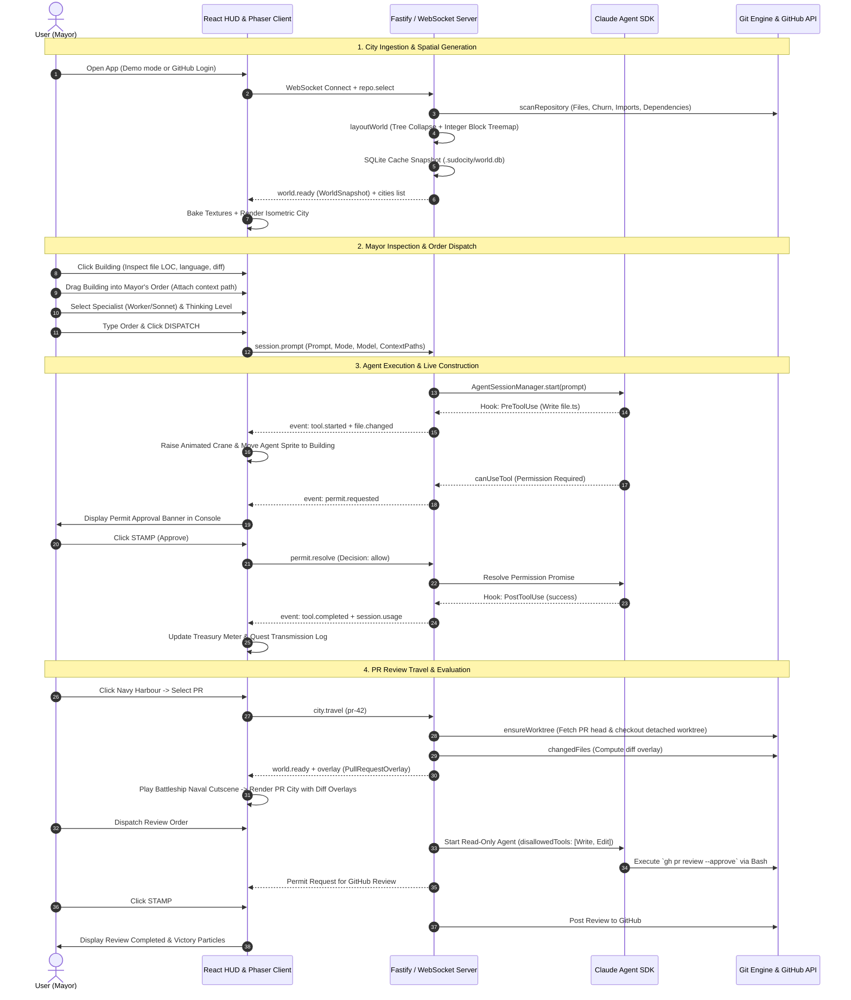

# Reference Architecture: Claude City (claude-clan)

This document provides an exhaustive technical analysis and architectural breakdown of the reference project [`claude-clan`](https://github.com/mittal-parth/claude-clan). It serves as the definitive reference specification for rebuilding the application functionality from scratch.

---

## Table of Contents
1. [Application Overview](#1-what-the-application-does)
2. [Core User-Facing Features](#2-core-user-facing-features)
3. [Overall Architecture](#3-overall-architecture)
4. [Frontend Architecture](#4-frontend-architecture)
5. [Backend Architecture](#5-backend-architecture)
6. [Agent Orchestration Architecture](#6-agent-orchestration-architecture)
7. [Coding Agent Launch Pipeline](#7-how-coding-agents-are-launched)
8. [Session & State Tracking](#8-how-sessions-are-tracked)
9. [Git Branch & Worktree Management](#9-how-git-branchesworktrees-are-managed)
10. [GitHub Integration & Authentication](#10-how-github-integration-works)
11. [Pull Request Lifecycle & Creation](#11-how-pull-requests-are-created)
12. [Review & Merge State Representation](#12-how-review-and-merge-states-are-represented)
13. [Important Dependencies](#13-important-dependencies)
14. [Environment Variables & Configuration](#14-environment-variables)
15. [End-to-End User Workflow](#15-end-to-end-user-workflow)

---

## 1. What the Application Does

**Claude City** transforms a software repository into an interactive, spatial 2.5D isometric pixel-art city where the user acts as the "Mayor" of the codebase. Instead of monitoring complex agentic development workflows through dense terminal logs or raw pull request diffs, the user oversees and orchestrates autonomous Claude AI coding agents through an interactive construction metaphor.

### Core Metaphor & Mapping
- **Districts**: Represent directories in the repository, geometrically organized using a squarified block-treemap algorithm sized according to lines of code (LOC).
- **Buildings**: Represent individual source files, with building heights determined by LOC and architectural styles/color palettes derived from programming languages.
- **Streets & Traffic**: Street networks, arterial boulevards, and ambient traffic (vehicles, boats, delivery vans) are derived directly from static AST import graphs and dependency relationships.
- **Landmarks & Facilities**:
  - **The Capitol**: Sits at the geometric core on a dedicated reserve block, representing central governance and housing the Issue Bazaar.
  - **The Harbour / Container Port**: Bridges the main city to isolated issue branches and local Git worktrees.
  - **The Naval Base**: Manages travel to GitHub Pull Request review cities.
  - **The Airport**: Handles long-distance international travel between distinct Git repositories.
- **Construction Sites & Cranes**: When an AI coding agent touches or edits files, construction scaffolds and animated cranes physically rise over the corresponding buildings, accompanied by the agent's on-site sprite and automatic camera tracking.

---

## 2. Core User-Facing Features

### 2.1. Spatial Isometric City Canvas
- **Phaser 3 Canvas Viewport**: Renders an isometric tile grid projection ($screenX = originX + (u - v) \times 48$, $screenY = originY + (u + v) \times 24 - z$) with $u + v$ depth sorting.
- **Interactive Controls**: Smooth click-and-drag camera panning, inertia-free mouse-wheel zooming, and automatic camera focusing on active construction sites.
- **Ambient Simulation**: Dynamic land vehicles moving across road networks, boats navigating shorelines and harbor lanes, and day/night water reflections.

### 2.2. Collapsible HUD & Console System
- **Floating HUD Windows**: Modular retro-themed panels (Mayor Console, Mayor's Order, City Scan, Inspector) that can be collapsed or repositioned. HUD state persists in `localStorage`.
- **System Telemetry**: Real-time indicators for WebSocket connection status, auto-reconnect backoff, context stamina meter, and Treasury spend tracking ($USD spent vs. configured budget ceiling).
- **Procedural 8-bit Audio Engine**: Web Audio API-synthesized sound effects for clicks, approvals, denials, tool completions, shutter snaps, and transitions.

### 2.3. Mayor's Order Dispatcher & Drag-and-Drop Context
- **Prompt Execution**: Command input allowing the Mayor to issue natural language construction orders.
- **Drag-and-Drop Context**: Users can drag buildings directly from the Phaser canvas into the Mayor's order form to attach explicit file paths as context.
- **Permission Modes**:
  - **Ask Mayor (Default)**: Pauses execution on sensitive tool operations (file modifications, bash execution) for human review and permit approval.
  - **Don't Disturb (Auto)**: Allows autonomous agent operation without interactive permit pauses.

### 2.4. Crew Specialist Selection
- **Role Selection**:
  - **Architect (Claude Opus)**: Optimized for complex architectural refactors and long-horizon tasks.
  - **Worker (Claude Sonnet)**: General-purpose code edits, bug fixes, and continuous construction.
  - **Runner (Claude Haiku)**: Fast, lightweight edits, renames, and minor adjustments.
- **Thinking Effort Control**: Configurable reasoning levels: `LOW`, `MEDIUM`, `HIGH`, `EXTRA HIGH`, and `MAX`.
- **Portraits & Sprites**: Unique pixel-art avatars for each specialist and effort tier.

### 2.5. Building Inspector & Diff Viewer
- **Building Inspection**: Clicking any building reveals file path, directory path, total line count, language classification, and PR change status.
- **Embedded Unified Diff Viewer**: Displays syntax-highlighted diffs for added, modified, or deleted files in PR workspaces.

### 2.6. Permits & Transmissions Log
- **Permit Approval Modal**: When an agent requests a gated action, a permit banner appears in the console allowing the Mayor to **Stamp** (allow) or **Deny** the operation.
- **Radio Transmissions (Quest Log)**: Streams real-time agent thoughts, messages, tool execution statuses, subagents, and task completions in an 8-bit retro quest log.

### 2.7. PR Port Cities & Issue Cities
- **Pull Request Port Cities (`pr-<number>`)**: Every open GitHub PR is rendered as an isolated port city with full visual diff overlays (new structures, yellow scaffolds for modifications, rubble for deletions) and a read-only review agent.
- **Issue Detached Cities (`issue-<number>`)**: Detached writable branches where agents can independently implement and verify bug fixes.
- **Multi-Modal Travel Cutscenes**:
  - **Naval Battleships**: Travel to PR review cities.
  - **Cargo Container Ships**: Travel to Issue worktrees.
  - **Airplanes**: Cross-repository flights between demo and user-imported repositories.

### 2.8. Global Command Palette (`⌘K` / `Ctrl+K`)
- Fuzzy search across all files in the repository with instant camera fly-to animation, Mayor actions (district rescan, halt construction, refresh PRs), and city-to-city fast travel.

### 2.9. Snapshot & Share Modal
- Full-resolution HTML5 canvas capture with camera shutter flash animation, preview modal, clipboard copy, and snapshot card generation.

---

## 3. Overall Architecture

The application is organized as a monorepo using `pnpm` workspaces, enforcing strict boundaries between data protocols, domain transformations, server orchestration, and client presentation.

```
┌────────────────────────────────────────────────────────────────────────┐
│                              apps/web                                  │
│             React 19 + Phaser 3 Isometric Game Client                  │
└───────────────────────────────────▲────────────────────────────────────┘
                                    │ WebSocket (ServerMessage / MayorCommand)
                                    │ HTTP REST (/api/auth, /api/repos)
┌───────────────────────────────────▼────────────────────────────────────┘
│                             apps/server                                │
│          Fastify + WebSocket Server + Multi-Tenant Workspace           │
└───────┬──────────────┬──────────────┬───────────────┬──────────────────┘
        │              │              │               │
┌───────▼──────┐┌──────▼──────┐┌──────▼──────┐┌───────▼──────┐┌───────────▼──────┐
│packages/agent││packages/    ││packages/    ││packages/     ││packages/protocol │
│Claude Agent  ││cities       ││worldgen     ││layout        ││Shared Zod Schemas│
│SDK Wrapper   ││Git Worktrees││Repo Scanner ││Lattice/Tree  ││Geometry Constants│
│              ││& GitHub API ││AST & Churn  ││Block Treemap ││Event Definitions │
└───────┬──────┘└──────┬──────┘└──────┬──────┘└───────┬──────┘└───────────┬──────┘
        │              │              │               │                   │
        └──────────────┴──────────────┴───────────────┴───────────────────┘
                                      │
                         ┌────────────▼────────────┐
                         │     packages/world      │
                         │ SQLite WorldStore (WAL) │
                         │  .sudocity/world.db     │
                         └─────────────────────────┘
```

### Pure Pipeline Dataflow
All repo processing downstream of a file scan is a deterministic, pure pipeline:
$$\text{Repository Files} \xrightarrow{\text{worldgen}} \text{WorldMap} \xrightarrow{\text{layout}} \text{WorldSnapshot} \xrightarrow{\text{world}} \text{SQLite Cache} \xrightarrow{\text{server}} \text{Client Phaser Renderer}$$

---

## 4. Frontend Architecture

### 4.1. Technology Stack
- **Framework**: React 19, TypeScript, Vite.
- **Styling**: Tailwind CSS, Radix UI primitives (`@radix-ui/react-dialog`, `@radix-ui/react-popover`), Custom 8-bit retro theme utilities.
- **Isometric Renderer**: Phaser 3 (running in headless canvas mode inside React containers).
- **Icons & Audio**: `lucide-react`, procedural Web Audio API sound engine (`sound-engine.ts`).

### 4.2. Component & Hook Hierarchy
```
Root.tsx (Auth gate, active repo state, airport cross-repo travel router)
 ├── LoginScreen.tsx (GitHub OAuth entry & demo city button)
 ├── RepoPicker.tsx (GitHub App repository selector & importer modal)
 └── App.tsx (Main game workspace)
      ├── GameCanvas.tsx (React wrapper around Phaser WorldScene)
      ├── AppHud.tsx (HUD container overlay)
      │    ├── AppHudConsole.tsx (Mayor status, stamina, treasury, quest transmissions, permits)
      │    ├── AppHudOrder.tsx (Command prompt, context dropzone, specialist & permission selector)
      │    ├── AppHudInspector.tsx (File details, LOC, language, unified diff view)
      │    └── AppHudScan.tsx (Language breakdown & structure statistics)
      ├── AppDialogs.tsx (Command palette, Issue shop, PR shop, Worktree shop, Crew picker)
      └── ShutterFlash.tsx & ShareCityModal.tsx (Screenshot capture & export)
```

### 4.3. State Management (`useGameState`)
- **WebSocket Lifecycle**: Connects to `ws://HOST:PORT/ws`, manages exponential backoff reconnection (`RECONNECT_BASE_DELAY_MS` = 1s, `RECONNECT_MAX_DELAY_MS` = 30s), handles JSON command protocol.
- **Event Storage**: Caches `GameEvent` history per city in React state and synchronizes with `localStorage` (capped at `EVENTS_PER_CITY_CAP` = 200 events).
- **Construction Tracking**: `ConstructionTracker` registers active tool sites (`tool.started`, `file.changed`), manages decay grace periods (`CONSTRUCTION_GRACE_MS` = 4.5s), and debounces repository rescans (`RESCAN_DEBOUNCE_MS` = 350ms).

### 4.4. Phaser Game Scene Architecture (`WorldScene`)
To ensure high rendering performance with hundreds of buildings, the canvas uses a modular manager pattern and pre-baked texture atlases:
- **`WorldTerrainManager`**: Generates batched ground sprites using a single pre-baked `TERRAIN_ATLAS_KEY` (grass, sand, water, road masks, courtyards, paved plazas).
- **`WorldBuildingManager`**: Instantiates and depth-sorts buildings, manages color-coded language palettes, updates construction scaffolds, and renders diff overlays.
- **`WorldCameraController`**: Handles isometric coordinate transformations, boundary clamping, inertia, zoom levels (fitting, legible zoom, focused zoom), and smooth camera tweens.
- **`WorldHarbourManager`, `WorldNavyManager`, `WorldAirportManager`, `WorldIssueShopManager`**: Manage spatial placement, animations, and hover/click hit zones for port facilities and travel craft.
- **`WorldTransitionManager`**: Orchestrates visual travel cutscenes (fog-of-war wipes, plane approaches, boat departures).

---

## 5. Backend Architecture

### 5.1. Technology Stack
- **Server Framework**: Fastify 5.x with `@fastify/websocket` and `@fastify/cors`.
- **Runtime**: Node.js >= 22.5.0 (ES Modules).
- **Databases**:
  - **PostgreSQL (`pg` pool)**: Central server database for user profiles, session credentials, OAuth tokens, and imported repository mappings.
  - **SQLite (`node:sqlite` `DatabaseSync`)**: Local per-repository database (`.sudocity/world.db`) for snapshots, plot coordinate caching across layout versions, and event history.

### 5.2. Multi-Tenant Workspace Management (`WorkspaceManager`)
- **Isolation**: Each imported repository is instantiated as an isolated `Workspace` instance scoped to a `(userId, repoKey)` pair.
- **LRU Eviction**: Manages memory and disk constraints with a global cap of 80 active workspaces and 4 active workspaces per user. Workspaces with active agent queries (`hasRunningAgent()`) are protected from eviction.
- **Shared Budget Rationing**: A global spend ceiling (`SUDO_CITY_MAX_BUDGET_USD`, default $1.00) is tracked in memory across all open workspaces; remaining budget is dynamically rationed to each session before agent execution.

### 5.3. WebSocket & REST Endpoints
- **REST Routes**:
  - `GET /health`: Health check probe.
  - `GET /auth/github/start`: Initiates GitHub OAuth authorization.
  - `GET /auth/github/install`: Redirects to GitHub App installation picker.
  - `GET /auth/github/callback`: OAuth callback, exchanges authorization code for tokens, creates session.
  - `GET /api/auth/session`: Validates current Bearer token session.
  - `POST /api/auth/logout`: Revokes active session and GitHub token.
  - `GET /api/repos`: Lists accessible repositories for the signed-in user.
  - `POST /api/repos/import`: Clones and initializes an accessible GitHub repository.
- **WebSocket Protocol (`/ws`)**:
  - **Client Commands (`MayorCommand`)**: `session.auth`, `repo.select`, `session.prompt`, `session.interrupt`, `permit.resolve`, `world.request`, `city.travel`, `city.refresh`, `diff.request`.
  - **Server Messages (`ServerMessage`)**: `event`, `cities`, `issues`, `viewer`, `overlay`, `diff`, `repos`, `repo.status`, `error`.

---

## 6. Agent Orchestration Architecture

The orchestration engine wraps `@anthropic-ai/claude-agent-sdk` inside `AgentSessionManager` to provide bidirectional translation between SDK execution loops and spatial game events.

```
┌────────────────────────────────────────────────────────────────────────┐
│                        AgentSessionManager                             │
│                                                                        │
│   Mayor Prompt + Attached Context Paths + Permission Mode + Model      │
└───────────────────────────────────┬────────────────────────────────────┘
                                    │
                         query({ prompt, options })
                                    │
┌───────────────────────────────────▼────────────────────────────────────┐
│                    @anthropic-ai/claude-agent-sdk                      │
│                                                                        │
│   SDK Query Loop ─────────► SDK Hooks:                                 │
│     - Assistant Message       - PreToolUse (tool.started)              │
│     - Result / Usage          - PostToolUse / Failure (tool.completed) │
│     - canUseTool              - FileChanged (file.changed)             │
│                               - SubagentStart/Stop                     │
│                               - TaskCreated/Completed                  │
│                               - PreCompact/PostCompact                 │
└───────────────────────────────────┬────────────────────────────────────┘
                                    │
                        Normalized GameEvents
                                    │
┌───────────────────────────────────▼────────────────────────────────────┐
│                   Workspace & Client Presentation                      │
│                                                                        │
│   - SQLite Persistence (.sudocity/world.db)                            │
│   - WebSocket Broadcast -> React HUD & Phaser Construction Cranes      │
│   - canUseTool Permit Promise -> Awaiting Mayor Stamp / Deny           │
└────────────────────────────────────────────────────────────────────────┘
```

### 6.1. Tool Permission Model
- **Safe Tools**: `Read`, `Glob`, `Grep` are registered as safe tools and execute immediately without interruption.
- **Gated Tools**: In `default` permission mode, all modifying tools (e.g. `Write`, `Edit`, `Bash`) invoke `canUseTool`, which pauses SDK execution, emits a `permit.requested` event with tool input details, and waits on a promise.
- **Permit Resolution**: The Mayor receives the prompt in the UI and sends `permit.resolve` (`allow` or `deny`). The promise resolves with `{ behavior: "allow" }` or `{ behavior: "deny", message: "..." }`.

### 6.2. PR Review Agent Constraints
- When an agent is launched in a PR city (`pr-<number>`), mutating tools (`Write`, `Edit`, `NotebookEdit`) are passed to `disallowedTools`, completely stripping them from the model's context.
- The agent is given a specialized review system prompt and can publish review verdicts only by invoking `gh pr review` via `Bash`, which still halts for Mayor permit approval.

---

## 7. How Coding Agents are Launched

1. **User Initiation**: The Mayor types an order in the HUD Order input, optionally drags building tiles into the form as context paths, selects a Crew specialist (Architect, Worker, Runner), configures reasoning effort (`low` to `max`), chooses permission mode (`default` or `auto`), and clicks **Dispatch**.
2. **Command Dispatch**: Frontend transmits a `session.prompt` command via WebSocket:
   ```json
   {
     "type": "session.prompt",
     "cityId": "main",
     "prompt": "Refactor auth middleware to support session refresh tokens",
     "permissionMode": "default",
     "model": "sonnet",
     "effort": "high",
     "contextPaths": ["apps/server/src/auth-context.ts"]
   }
   ```
3. **Server Validation & Security**:
   - The server verifies that the target city exists.
   - `sanitizeContextPaths()` normalizes all file paths and prevents path traversal attacks outside the repository root.
4. **Agent Session Execution**:
   - An `AbortController` is allocated for the session.
   - Context files are appended to the prompt: `"Read these repository files before acting; they were attached as context for this order:\n- <path>"`.
   - The query is initialized via Claude Agent SDK `query()`.
   - A `session.started` event is broadcast to the client.
5. **Streaming Lifecycle**: As the query executes, assistant messages, usage statistics, file mutations, and tool events are translated in real-time to `GameEvent` objects and streamed to the client.

---

## 8. How Sessions are Tracked

Session tracking operates across three distinct tiers:

| Tier | Identifier / Storage | Purpose & Lifecycle |
|---|---|---|
| **Client Session** | 256-bit base64url Bearer token in `localStorage` | Authenticates HTTP REST requests and WebSocket connections (`session.auth`). |
| **PostgreSQL User Session** | `sessions` table in Postgres (`id`, `user_id`, `access_token`, `refresh_token`, `expires_at`, `revoked_at`) | Persists GitHub access credentials across process restarts; automatically rotates access tokens 60 seconds prior to expiration. |
| **Agent / City Session** | `sessionId` (`local-<UUID>`) per city in `Workspace` | Scopes event sequences and SQLite persistence (`events` table) in `<repo>/.sudocity/world.db`. |

---

## 9. How Git Branches/Worktrees are Managed

### 9.1. Worktree Topology
- **Primary City (`main`)**: Binds directly to the root checkout directory (`repoPath`).
- **PR Cities (`pr-<number>`)**: Located at `.sudocity/worktrees/pr-<number>`.
  - Created lazily when a user visits the PR city.
  - Fetches the PR head commit into a dedicated ref:
    ```bash
    git fetch origin pull/<number>/head:refs/sudo-city/pr-<number>
    ```
  - Added as a detached worktree:
    ```bash
    git worktree add --detach .sudocity/worktrees/pr-<number> refs/sudo-city/pr-<number>
    ```
  - If the PR is updated upstream, the worktree is fast-forwarded:
    ```bash
    git checkout --detach <newHeadSha>
    ```
- **Issue Cities (`issue-<number>`)**: Located at `.sudocity/worktrees/issue-<number>`.
  - Created as a detached writable worktree branching off `main`:
    ```bash
    git worktree add --detach .sudocity/worktrees/issue-<number> main
    ```
  - Isolates development so agent edits do not dirty the primary branch.
- **Local Worktrees**: Discovered using `git worktree list --porcelain` and mapped to local cities in the Harbour.
- **Pruning**: Stale or closed PR/issue worktrees are automatically cleaned up on roster refresh via `git worktree remove --force` followed by `git worktree prune` and directory deletion.

---

## 10. How GitHub Integration Works

### 10.1. Dual GitHub Client Implementation
- **`GitHubApiClient` (Production)**: Uses GitHub REST API with user installation access tokens or fallback `GITHUB_TOKEN`.
- **`GhCliClient` (Local Development)**: Shells out directly to the GitHub CLI (`gh pr list`, `gh issue list`, `gh pr review`).

### 10.2. GitHub App OAuth & Installation Flow
1. **App Installation**: User clicks "Grant Access" $\rightarrow$ redirected to `https://github.com/apps/<app-slug>/installations/new` with HMAC-signed CSRF state $\rightarrow$ user selects accessible repositories.
2. **User Login**: User clicks "Sign In" $\rightarrow$ redirected to `https://github.com/login/oauth/authorize` $\rightarrow$ GitHub redirects to `/auth/github/callback` with authorization code.
3. **Token Exchange**: Server calls `https://github.com/login/oauth/access_token` to retrieve `access_token`, `refresh_token`, and expiration metadata.
4. **Repository Ingestion**:
   - Accessible repos are fetched via `/user/installations` and `/user/installations/:id/repositories`.
   - On import, the server executes a shallow single-branch clone:
     ```bash
     git clone --depth=50 --single-branch https://x-access-token:<token>@github.com/<owner>/<repo>.git <destination>
     ```

---

## 11. How Pull Requests are Created

In the reference architecture:
- PRs are created upstream on GitHub by repository contributors.
- The backend discovers open PRs via `listOpenPullRequests()` (filtering `state=open`).
- When a user travels to an Issue city (`issue-<number>`) to implement a fix, the agent works inside the isolated detached worktree.
- Upon completing work, agents or users can push the branch to origin and open a PR via GitHub CLI or API.

---

## 12. How Review and Merge States are Represented

### 12.1. City Roster Status
- `idle`: Pull request detected on GitHub, but worktree not yet checked out.
- `building`: Worktree checkout, git fetch, or repository scan currently in progress.
- `ready`: Worktree scanned, geometry generated, and city ready for travel.
- `failed`: Worktree creation, fetch, or scan encountered an error.

### 12.2. Visual Diff Overlays on the Map
When viewing a PR city, the base checkout (`main`) and head commit (`headSha`) are compared via `git diff --name-status` and `git diff --numstat`:
- **Added Files**: Rendered as newly constructed building sprites.
- **Modified Files**: Display existing building sprites overlaid with yellow construction scaffold textures.
- **Deleted Files**: Rendered as ghost plots with rubble markers where the file's building stood on `main`.

### 12.3. Publishing PR Reviews
The review agent publishes official GitHub verdicts via CLI or REST API:
- `APPROVE` $\rightarrow$ `gh pr review <number> --approve --body "..."`
- `REQUEST_CHANGES` $\rightarrow$ `gh pr review <number> --request-changes --body "..."`
- `COMMENT` $\rightarrow$ `gh pr review <number> --comment --body "..."`
*(Execution is paused for Mayor permit approval before the review command is executed).*

---

## 13. Important Dependencies

### Frontend (`apps/web`)
- `react`, `react-dom` (v19.x) - UI rendering.
- `phaser` (v3.88.x) - 2D WebGL/Canvas game engine for isometric rendering.
- `vite` - Build tool and development server.
- `@radix-ui/react-dialog`, `@radix-ui/react-popover`, `@radix-ui/react-slot` - Accessible UI primitives.
- `cmdk` - Command palette modal.
- `lucide-react` - Icon set.
- `tailwind-merge`, `clsx` - Dynamic styling.
- `canvas-confetti` - Celebration particle effects.

### Backend & Orchestration (`apps/server`, `packages/*`)
- `fastify`, `@fastify/websocket`, `@fastify/cors` - HTTP/WebSocket backend server.
- `ws` - WebSocket protocol implementation.
- `pg` - PostgreSQL client for session/user persistence.
- `@anthropic-ai/claude-agent-sdk` - Autonomous Claude coding agent orchestration.
- `zod` - Runtime type validation and shared protocol schema enforcement.
- `dependency-cruiser` - AST analysis of JavaScript/TypeScript import graphs.
- `ignore` - Parser for `.gitignore` rules during fallback repository directory walking.

### Development & Tooling
- `typescript` (v5.8.x) - Strict static typing across all workspaces.
- `vitest` - Unit and integration testing framework.
- `pnpm` (v11.x) - Fast, disk-efficient package and workspace management.

---

## 14. Environment Variables

| Variable | Default | Purpose |
|---|---|---|
| `HOST` | `127.0.0.1` | Network interface for backend server binding. |
| `PORT` | `4100` | Port for backend server. |
| `WEB_ORIGIN` | `http://127.0.0.1:5173` | Allowed origin for CORS headers and OAuth callback redirection. |
| `SUDO_CITY_REPO` | Current working directory | Root repository directory used for the default local/demo city. |
| `SUDO_CITY_MAX_BUDGET_USD` | `1` | Global spend ceiling in USD rationed across all active agent sessions. |
| `SUDO_CITY_CLONE_ROOT` | `<tmpdir>/sudocity` | Base filesystem path where per-user repository clones are cached. |
| `ANTHROPIC_API_KEY` | *(Optional)* | Anthropic API key for Claude Agent SDK (falls back to local Claude Code login). |
| `GITHUB_CLIENT_ID` | *(Optional)* | GitHub App OAuth Client ID. |
| `GITHUB_CLIENT_SECRET` | *(Optional)* | GitHub App OAuth Client Secret. |
| `GITHUB_APP_SLUG` | *(Optional)* | GitHub App slug used to generate installation URLs. |
| `SESSION_SECRET` | *(Optional)* | Secret key used for HMAC-SHA256 signing of OAuth CSRF state parameters. |
| `DATABASE_URL` | *(Optional)* | PostgreSQL connection string for user sessions and imported repository tracking. |
| `GITHUB_TOKEN` | *(Optional)* | Personal access token for unauthenticated demo city GitHub API rate limit lifting. |
| `VITE_WS_URL` | `ws://127.0.0.1:4100/ws` | WebSocket server URL for client connection. |
| `VITE_API_URL` | `http://127.0.0.1:4100` | REST API base URL for client HTTP requests. |

---

## 15. End-to-End User Workflow


